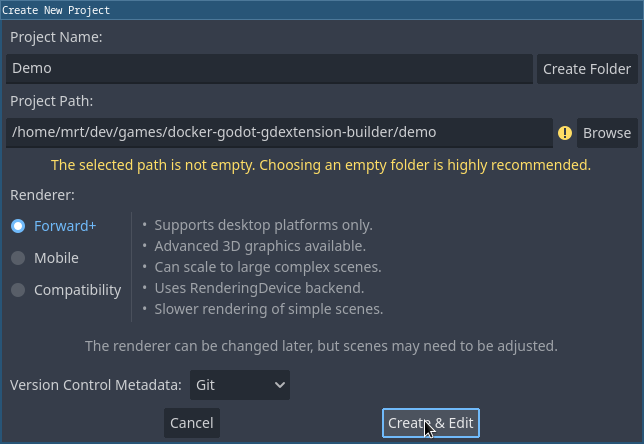
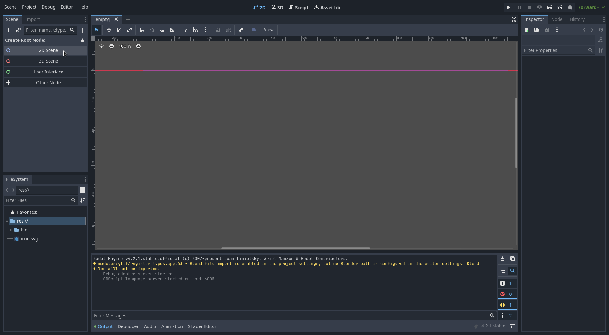
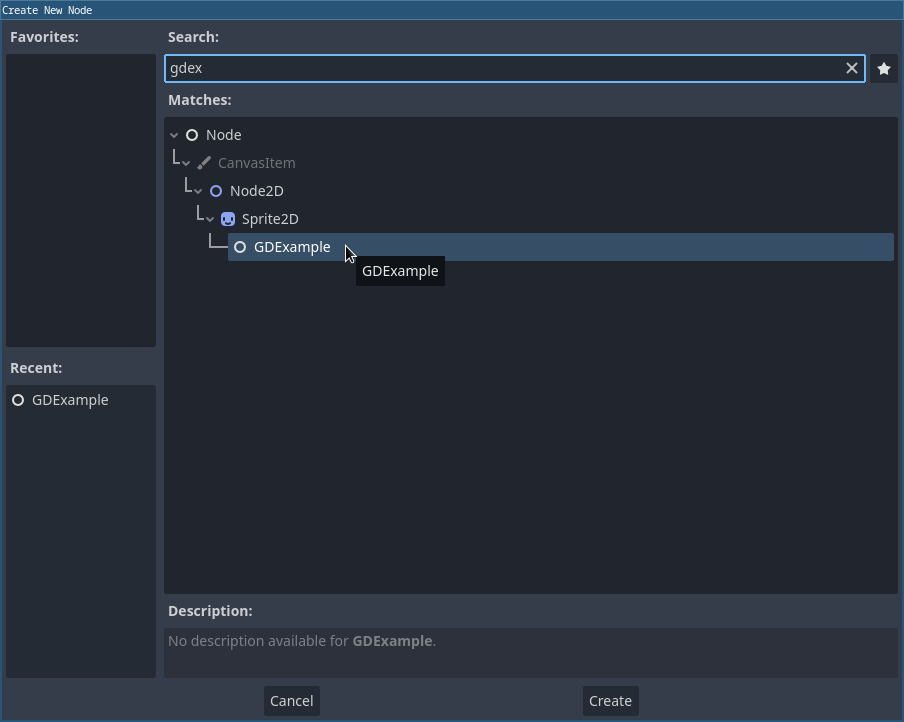
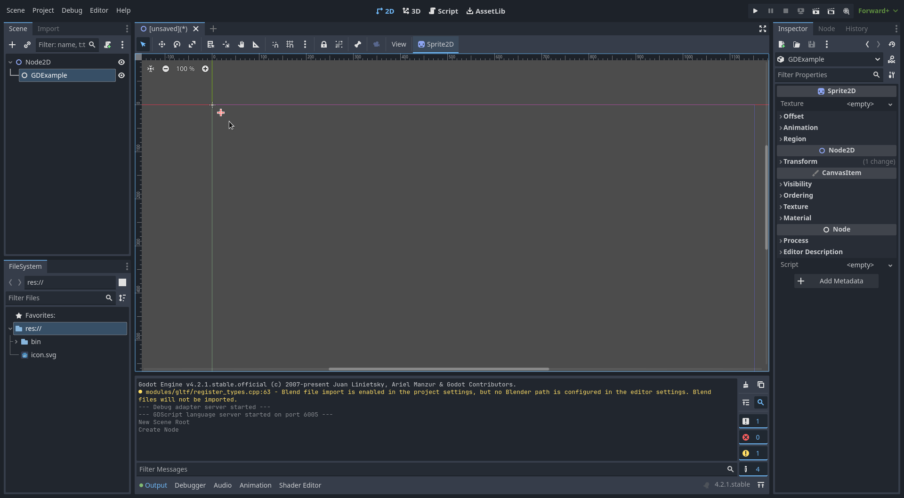

# Building Godot 4 GDExtension C++ example with Docker

## Requirements

* [Docker](https://docs.docker.com/engine/install/)
* [Git](https://git-scm.com/book/en/v2/Getting-Started-Installing-Git)

## Instructions

### [Windows]

You have to run all the following commands from a **Git Bash** prompt.

## Clone this repository

```sh
git clone https://github.com/mrt-prodz/docker-godot-gdextension-builder
cd docker-godot-gdextension-builder
```

## Building the docker image

Run the following command to build `mrt-prodz/godot-gdextension-builder:latest` docker image:

```sh
docker build -t mrt-prodz/godot-gdextension-builder:latest .
```

or you can use docker compose:

```sh
docker compose build
```

This docker image will contain the following softwares:

* [mingw-w64](https://mingw-w64.org/) v12.2.0
* [scons](https://scons.org/) v4.5.2

## Getting the *C++ bindings* for the [**Godot Engine**](https://github.com/godotengine/godot)'s GDExtensions API

Clone Godot 4.2 stable branch and initialize the submodules:

```sh
git clone -b 4.2 https://github.com/godotengine/godot-cpp
cd godot-cpp
git submodule update --init
cd ..
```

## Building Godot GDExtension C++ example

The source files in the `src` directory of this repository are copies from the Godot 4.2 documentation.

From within this repository root directory:

### [Windows] and [Linux]

You should now be able to build by just running the following command:

```sh
./build.sh
```

If your operating system is not detected automatically, you can still run one of the following command manually:

### [Windows]

```sh
winpty docker run --rm -it -v /$(pwd):/mnt mrt-prodz/godot-gdextension-builder scons platform=windows -j4
```

### [Linux]

```sh
docker run --rm -it -v /etc/passwd:/etc/passwd:ro -v /etc/group:/etc/group:ro -u $(id -u):$(id -g) -v ${PWD}:/mnt mrt-prodz/godot-gdextension-builder scons platform=linux -j4
```

## Using your new extension

In order to use your newly built GDExtension you need to run a version of Godot equal or higher than the repository version you cloned.

For this repository, open Godot 4.2, create a project in the `demo` folder and you should see the GDExtension loading automatically.

[](./screenshots/01.png)

Create a new `2D Scene`, press `CTRL + a` then add a `GDExample` Node. You should see the position of the Node randomly moving.

[](./screenshots/02.png)

[](./screenshots/03.png)

[](./screenshots/04.png)

# Note

This repository was made to help people getting started with Godot GDExtension C++ development without cluttering their operating system with various packages and softwares.

We use Godot 4.2 stable branch but if you would like to use a more recent version you will have to change `4.2` with another branch when cloning the `godot-cpp` repository.

Simply change the version in the `git clone -b 4.x https://github.com/godotengine/godot-cpp` command.

The GDExtension example in this repository is coming from the Godot 4.2 documentation. There is no `Engine.is_editor_hint()` check in the process method in order to avoid running the code inside the Godot editor. Keep this in mind if you start experimenting with heavy calculations to avoid crashing the editor.

# Resources

[GDExtension C++ example](https://docs.godotengine.org/en/4.2/tutorials/scripting/gdextension/gdextension_cpp_example.html)
